<div align="center">

# github-profile-score

**An embeddable job-readiness scorer for GitHub profiles — powered by heuristics + AI callouts**

If this project saves you time, consider giving it a star. It helps others find it.

[](https://github.com/DanielDeshmukh/github-profile-score)

[](https://github.com/DanielDeshmukh/github-profile-score/actions/workflows/ci.yml)
[](https://opensource.org/licenses/MIT)
[](https://nodejs.org/)
[](https://www.typescriptlang.org/)
[](https://vitest.dev/)

Drop a badge into any README and let your GitHub profile speak for itself.

```markdown
[](https://YOUR_DOMAIN/score/YOUR_USERNAME)
```

</div>

---

## Table of Contents

- [What Is This?](#what-is-this)
- [Quick Deploy](#quick-deploy)
- [Scoring Dimensions](#scoring-dimensions)
- [API Endpoints](#api-endpoints)
  - [Score Badge](#score-badge-endpoints)
  - [Stats Cards](#stats-card-endpoints)
  - [Insight Widgets](#insight-widget-endpoints)
  - [Health Check](#health-endpoint)
- [Embedding Guide](#embedding-guide)
- [Theming](#theming)
- [Architecture](#architecture)
- [Getting Started](#getting-started-local-development)
- [Environment Variables](#environment-variables)
- [Project Structure](#project-structure)
- [Caching Strategy](#caching-strategy)
- [Contributing](#contributing)
- [License](#license)

---

## What Is This?

`github-profile-score` analyzes a GitHub profile across five hiring-signal dimensions and produces:

- **A live SVG badge** you embed directly in your README (`/score/{username}.svg`)
- **Stats cards** showing contributions, streaks, and language breakdown
- **Insight widgets** revealing activity patterns, repo health, and account metrics
- **A detailed HTML breakdown** with dimension scores and AI-written fix callouts
- **A shareable permalink** for your portfolio or job applications

The scoring is intentionally transparent — no black box. Raw scores are calculated from GitHub API data using documented heuristics. NVIDIA NIM (free tier, optional) then interprets those scores into human-readable "what to fix" notes.

---

## Visual Templates

All SVG card outputs are available as static templates in the [`templates/`](./templates/) directory. Open them in a browser to see exactly what each card looks like.

### Score & Stats Cards

| Card | Preview File | Dimensions |
|------|-------------|------------|
| Score Badge | [`01-score-badge.svg`](./templates/01-score-badge.svg) | 480×260 |
| Contributions Card | [`02-contributions-card.svg`](./templates/02-contributions-card.svg) | 480×200 |
| Overview Card | [`03-overview-card.svg`](./templates/03-overview-card.svg) | 480×200 |
| Languages Card | [`04-languages-card.svg`](./templates/04-languages-card.svg) | 480×200 |

### Insight Widgets

| Widget | Preview File | Dimensions |
|--------|-------------|------------|
| Most Active Repo | [`05-insight-most-active-repo.svg`](./templates/05-insight-most-active-repo.svg) | 320×80 |
| Account Age | [`06-insight-account-age.svg`](./templates/06-insight-account-age.svg) | 320×80 |
| Most Starred Repo | [`07-insight-most-starred-repo.svg`](./templates/07-insight-most-starred-repo.svg) | 320×80 |
| Contribution Trend | [`08-insight-contribution-trend.svg`](./templates/08-insight-contribution-trend.svg) | 320×80 |
| Avg Commits per Repo | [`09-insight-avg-commits-per-repo.svg`](./templates/09-insight-avg-commits-per-repo.svg) | 320×80 |
| Longest-Maintained Repo | [`10-insight-longest-maintained-repo.svg`](./templates/10-insight-longest-maintained-repo.svg) | 320×80 |
| Commit Pattern | [`11-insight-commit-pattern.svg`](./templates/11-insight-commit-pattern.svg) | 320×100 |
| Commits per Tenure | [`12-insight-commits-per-tenure.svg`](./templates/12-insight-commits-per-tenure.svg) | 320×80 |

### Error States

| Error | Preview File |
|-------|-------------|
| Rate Limit | [`13-error-rate-limit.svg`](./templates/13-error-rate-limit.svg) |
| User Not Found | [`14-error-user-not-found.svg`](./templates/14-error-user-not-found.svg) |

---

## Quick Deploy (Fork & Go)

Deploy in under 5 minutes — no cloning required.

1. **Fork** this repo
2. **Deploy** using one of the buttons below
3. **Add** your `GITHUB_TOKEN` environment variable
4. **Copy** the badge URL to your profile README

| Platform | Deploy Button |
|----------|---------------|
| **Railway** | [](https://railway.app/new?template=https://github.com/DanielDeshmukh/github-profile-score) |
| **Render** | [](https://render.com/deploy?repo=https://github.com/DanielDeshmukh/github-profile-score) |

> **Note:** `NVIDIA_API_KEY` is optional. Without it, you'll get generic improvement suggestions instead of AI-personalized ones.

---

## Scoring Dimensions

Each dimension scores **0–20 points** (total: 100).

| Dimension | What's Measured | Key Signals |
|-----------|----------------|-------------|
| **Activity** | Consistency of contributions | Commit frequency, streak length, recency of pushes |
| **Project Quality** | Are repos worth looking at? | Stars, forks, watchers, presence of topics/description |
| **Documentation** | Can someone understand your work? | README presence & length, wiki usage, GitHub Pages |
| **Tech Diversity** | Breadth of stack | Language count, repo type spread (lib vs app vs tool) |
| **Community** | Collaboration signals | PRs to others, issues filed, org membership, followers:following ratio |

> **Raw scores are heuristic — no LLM involved.** NVIDIA NIM only writes the "fix callout" text for dimensions that score below threshold. This keeps latency low and costs zero.

---

## API Endpoints

### Score Badge Endpoints

#### Score Badge (SVG)

Embed the job-readiness score badge in your README:

```markdown
[](https://YOUR_DOMAIN/score/YOUR_USERNAME/html)
```

**How it looks on your README:**

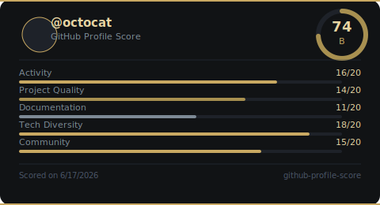

The badge renders a 480×260 card with:
- User avatar and `@username`
- Circular grade ring (A–F) with numeric score
- 5 dimension progress bars (Activity, Quality, Documentation, Diversity, Community)
- Scored-on date footer

**Query Parameters:**

| Parameter | Type | Description |
|-----------|------|-------------|
| `refresh` | `?refresh=1` | Bust the cache and re-score (rate-limited to 1 refresh per 10 min per username) |

**Response Headers:**

| Header | Value |
|--------|-------|
| `Content-Type` | `image/svg+xml` |
| `Cache-Control` | `public, max-age=3600, s-maxage=3600` |
| `ETag` | `"<total>-<scored_at>"` |

**Error States:**

| Status | Condition | How it looks |
|--------|-----------|--------------|
| `404` | User not found | 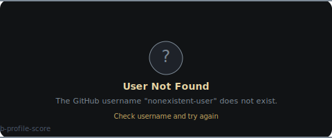 |
| `429` | Rate limited | 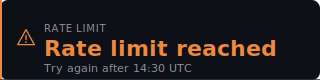 |

---

#### Score JSON

Returns the full score payload as JSON.

```markdown
GET /score/YOUR_USERNAME
```

**Response:**

```json
{
  "username": "octocat",
  "total": 74,
  "grade": "B",
  "dimensions": {
    "activity":      { "score": 16, "max": 20, "callout": null },
    "quality":       { "score": 14, "max": 20, "callout": null },
    "documentation": { "score": 11, "max": 20, "callout": "Your documentation score is low." },
    "diversity":     { "score": 18, "max": 20, "callout": null },
    "community":     { "score": 15, "max": 20, "callout": null }
  }
}
```

---

#### Score HTML

Full HTML report with dimension breakdown, fix callouts, and comparison percentiles. Opens in browser — not embeddable in README.

```markdown
https://YOUR_DOMAIN/score/YOUR_USERNAME/html
```

---

#### Score Plan

Returns a prioritized improvement plan sorted by points available.

```markdown
GET /score/YOUR_USERNAME/plan
```

**Response:**

```json
{
  "username": "octocat",
  "total": 74,
  "grade": "B",
  "improvements": [
    {
      "dimension": "documentation",
      "current_score": 11,
      "max_score": 20,
      "points_available": 9,
      "callout": "Your documentation score is low.",
      "priority": 1
    }
  ]
}
```

---

### Stats Card Endpoints

Stats cards use a gold/charcoal theme and are **independent** from the score badge — separate caching, refresh cycles, and API calls.

#### Contributions Card

Embed the contributions/streak card in your README:

```markdown

```

**How it looks on your README:**

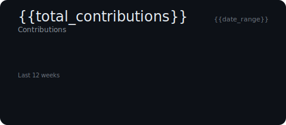

The card renders a 480×200 card showing:
- Total contributions count and date range
- Current streak with progress ring
- Longest streak count
- 12-week contribution calendar heatmap

---

#### Overview Card

Embed the GitHub stats overview card in your README:

```markdown

```

**How it looks on your README:**


The card renders a 480×200 card showing:
- Repos count (public/total)
- Total stars earned
- Followers/following counts
- Top languages with progress bars
- Mini contribution calendar

---

#### Languages Card

Embed the language breakdown card in your README:

```markdown

```

**How it looks on your README:**

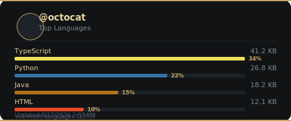

The card renders a 480×200 card showing:
- Language names with proportional progress bars
- Byte counts for each language
- Percentage breakdown
- "+ more" indicator for additional languages

---

### Insight Widget Endpoints

Insight widgets are individually-renderable SVG cards revealing activity patterns, repo health, and account statistics. Each uses the gold/charcoal theme.

All insight endpoints support `?refresh=1` to bust the cache.

---

#### Most Active Repo

Embed the most active repository widget in your README:

```markdown

```

**How it looks on your README:**

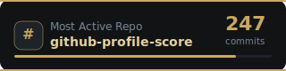

Shows the repository where the user has the most commits. Displays:
- Repository name (clickable link)
- Total commit count
- Activity bar indicator

**JSON field:** `mostActiveRepo: { repoName, commitCount, repoUrl }`

---

#### Account Age

Embed the account age widget in your README:

```markdown

```

**How it looks on your README:**

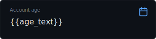

Shows how long the GitHub account has existed. Displays:
- Years and months since creation
- Account creation year
- Timeline indicator

**JSON field:** `accountAge: { years, months, createdAt }`

---

#### Most Starred Repo

Embed the most starred repository widget in your README:

```markdown

```

**How it looks on your README:**

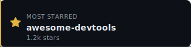

Shows the user's repository with the most GitHub stars. Displays:
- Repository name (clickable link)
- Star count (with k/M abbreviations)
- Star bar indicator

**JSON field:** `mostStarredRepo: { repoName, stars, repoUrl }`

---

#### Contribution Trend

Embed the contribution trend widget in your README:

```markdown

```

**How it looks on your README:**

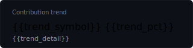

Shows year-over-year contribution change with directional arrows. Displays:
- Percentage change (↑/↓/→)
- Direction label (growing/declining/stable)
- Trend bar indicator

| Symbol | Meaning |
|--------|---------|
| `↑` | Trending up (> +3% YoY) |
| `↓` | Trending down (< −3% YoY) |
| `→` | Steady (within ±3%) |

**JSON field:** `contributionTrend: { thisYearTotal, lastYearTotal, yoyPercentage, direction }`

---

#### Avg Commits per Repo

Embed the average commits per repository widget in your README:

```markdown

```

**How it looks on your README:**

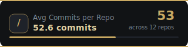

Shows average commits per active repository. Displays:
- Average commit count
- Total commits across all repos
- Number of active repos

**JSON field:** `avgCommitsPerRepo: { average, activeRepos, totalCommits }`

---

#### Longest-Maintained Repo

Embed the longest-maintained repository widget in your README:

```markdown

```

**How it looks on your README:**

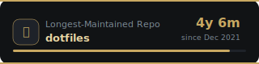

Shows the repository with the longest maintenance span. Displays:
- Repository name (clickable link)
- Duration in years/months/days
- Duration bar indicator

| Duration | Format |
|----------|--------|
| ≥ 365 days | `Xy Ym` or `Xy` |
| ≥ 30 days | `Xm` |
| < 30 days | `Xd` |

**JSON field:** `longestMaintainedRepo: { repoName, spanDays, repoUrl, firstCommitDate, lastCommitDate }`

---

#### Commit Pattern

Embed the commit pattern widget in your README:

```markdown

```

**How it looks on your README:**

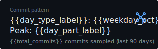

Shows the user's approximate commit time-of-day and day-of-week pattern. **Labeled approximate** — based on a 90-day sample. Displays:
- Dominant day type (weekday/weekend) with percentages
- Dominant daypart (mornings/afternoons/evenings/late nights)
- Sample size note

| Daypart | Hours (UTC) |
|---------|-------------|
| Mornings | 06:00–11:59 |
| Afternoons | 12:00–17:59 |
| Evenings | 18:00–23:59 |
| Late nights | 00:00–05:59 |

**JSON field:** `commitPattern: { weekdayCount, weekendCount, dominantDayType, dominantDayPart, totalCommits }`

---

#### Commits per Tenure

Embed the commits per tenure widget in your README:

```markdown

```

**How it looks on your README:**

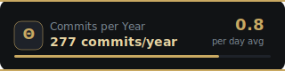

Shows average commits per year of account tenure. Zero new API calls — pure derivation from profile age and contribution count. Displays:
- Commits per year average
- Total commits
- Tenure in years

**JSON field:** `commitsPerTenure: { average, totalCommits, tenureYears }`

---

### Health Endpoint

#### `GET /health`

Liveness check. Returns cache status, uptime, and GitHub API rate limit remaining.

```markdown
GET /health
```

**Response:**

```json
{
  "status": "healthy",
  "uptime": 3847.2,
  "cache": { "type": "redis", "connected": true },
  "github": { "rateLimitRemaining": 4832 }
}
```

---

## Theming

All SVG cards use a GitHub-inspired dark dashboard theme. The color palette is centralized in `src/theme/tokens.ts`:

| Token | Hex | Usage |
|-------|-----|-------|
| `bg` | `#0d1117` | Card backgrounds |
| `bgCard` | `#161b22` | Inner card surfaces |
| `textPrimary` | `#e6edf3` | Headings, big numbers |
| `textMuted` | `#8b949e` | Labels, secondary text |
| `blue` | `#58a6ff` | Primary accent (streaks, rings) |
| `purple` | `#a371f7` | Secondary accent (grade ring) |
| `green` | `#3fb950` | Positive trend, contributions |
| `orange` | `#f0883e` | Warnings, highlights |
| `red` | `#f85149` | Errors, declining trend |
| `gold` | `#e3b341` | Stars, special values |
| `border` | `rgba(48, 54, 61, 0.8)` | Card borders, dividers |
| `borderAccent` | `rgba(88, 166, 255, 0.2)` | Accent borders |

**Language bar segments** preserve each language's recognizable GitHub brand color (e.g. Python blue `#3572A5`, JS yellow `#f1e05a`) — only the card chrome uses the dark theme tokens.

> **Note:** Custom theme overrides via query parameters are not yet supported but may be added in a future release.

---

## Architecture

```
┌─────────────────────────────────────────────────────────────────┐
│                        HTTP Request                              │
│          GET /score/:username.svg  |  GET /stats/...  |  ...    │
└───────────────────────────┬─────────────────────────────────────┘
                            │
                            ▼
                ┌───────────────────────┐
                │   Express Router      │
                └──────────┬────────────┘
                           │
                           ▼
                ┌───────────────────────┐      ┌──────────────┐
                │   Redis Cache         │─────▶│  Cache Hit?  │──▶ return SVG
                │   TTL: 6 hours        │      └──────────────┘
                └──────────┬────────────┘
                           │ miss
                           ▼
                ┌───────────────────────┐
                │   GitHubFetcher       │  (REST: profile, repos, events)
                │   StatsFetcher        │  (GraphQL: contributions, languages)
                │   InsightFetchers     │  (per-insight: commit counts, spans)
                └──────────┬────────────┘
                           │
                           ▼
                ┌───────────────────────┐
                │   Scorer / Calculator │
                │   (pure functions)    │
                └──────────┬────────────┘
                           │
                           ▼
                ┌───────────────────────┐
                │   NVIDIA NIM          │
                │  (score badge only)   │
                │  writes fix callouts  │
                └──────────┬────────────┘
                           │
                           ▼
                ┌───────────────────────┐
                │   SVG Renderer        │
                │   (template strings)  │
                └──────────┬────────────┘
                           │
                           ▼
                      SVG Response
                  + cache write (6h TTL)
```

---

## Getting Started (Local Development)

### Prerequisites

- Node.js 18+
- Docker (recommended) OR Redis locally
- GitHub Personal Access Token (for 5,000 req/hr vs 60 req/hr unauthenticated)
- NVIDIA NIM API key ([free at build.nvidia.com](https://build.nvidia.com/)) — optional

### Quick Start with Docker

```bash
git clone https://github.com/DanielDeshmukh/github-profile-score.git
cd github-profile-score
cp .env.example .env
# Edit .env and add your GITHUB_TOKEN
docker compose up
```

### Quick Start without Docker

```bash
git clone https://github.com/DanielDeshmukh/github-profile-score.git
cd github-profile-score
npm install
cp .env.example .env
# Edit .env and add your GITHUB_TOKEN
npm run dev
```

### Available Scripts

| Script | Description |
|--------|-------------|
| `npm run dev` | Start dev server with hot reload |
| `npm run build` | Compile TypeScript to `dist/` |
| `npm start` | Run production build |
| `npm test` | Run test suite (vitest) |
| `npm run test:watch` | Run tests in watch mode |
| `npm run lint` | Run ESLint |

---

## Environment Variables

| Variable | Required | Default | Description |
|----------|----------|---------|-------------|
| `GITHUB_TOKEN` | **Yes** | — | GitHub Personal Access Token |
| `NVIDIA_API_KEY` | No | — | NVIDIA NIM API key for AI callouts |
| `REDIS_URL` | No | — | Redis connection string (empty = in-memory cache) |
| `PORT` | No | `3000` | Server port |
| `CACHE_TTL_SECONDS` | No | `21600` (6h) | Score badge cache TTL |
| `STATS_CACHE_TTL_SECONDS` | No | `21600` (6h) | Stats card cache TTL |
| `SCORE_THRESHOLD` | No | `14` | Dimensions below this get AI callouts |

---

## Project Structure

```
github-profile-score/
├── src/
│   ├── fetcher/
│   │   ├── GitHubFetcher.ts              # REST API calls (profile, repos, events)
│   │   ├── StatsFetcher.ts               # GraphQL stats (contributions, languages)
│   │   └── insights/
│   │       ├── InsightFetcher.ts          # Per-repo commit counts
│   │       ├── ContributionTrendFetcher.ts # 2-year contribution calendars
│   │       ├── LongestMaintainedFetcher.ts # First/last commit per repo
│   │       └── CommitPatternFetcher.ts    # Commit timestamps from events
│   ├── scorer/
│   │   ├── HeuristicScorer.ts            # Dimension scoring logic
│   │   ├── streak.ts                     # Contribution streak calculation
│   │   ├── dimensions/
│   │   │   ├── activity.ts
│   │   │   ├── quality.ts
│   │   │   ├── documentation.ts
│   │   │   ├── diversity.ts
│   │   │   └── community.ts
│   │   └── insights/
│   │       ├── mostActiveRepo.ts
│   │       ├── accountAge.ts
│   │       ├── mostStarredRepo.ts
│   │       ├── contributionTrend.ts
│   │       ├── avgCommitsPerRepo.ts
│   │       ├── longestMaintainedRepo.ts
│   │       ├── commitPattern.ts
│   │       └── commitsPerTenure.ts
│   ├── renderer/
│   │   ├── SvgRenderer.ts                # Score badge SVG
│   │   ├── HtmlRenderer.ts               # HTML report
│   │   ├── JsonRenderer.ts               # JSON output
│   │   ├── ContributionsCardRenderer.ts   # Contributions/streak SVG
│   │   ├── StatsCardRenderer.ts          # Stats + languages SVG
│   │   ├── shared/
│   │   │   └── ring.ts                   # Shared grade/progress ring
│   │   └── insights/
│   │       ├── MostActiveRepoCard.ts
│   │       ├── AccountAgeCard.ts
│   │       ├── MostStarredRepoCard.ts
│   │       ├── ContributionTrendCard.ts
│   │       ├── AvgCommitsPerRepoCard.ts
│   │       ├── LongestMaintainedRepoCard.ts
│   │       ├── CommitPatternCard.ts
│   │       └── CommitsPerTenureCard.ts
│   ├── routes/
│   │   ├── stats.ts                      # Stats card endpoints
│   │   └── insights/
│   │       ├── mostActiveRepo.ts
│   │       ├── accountAge.ts
│   │       ├── mostStarredRepo.ts
│   │       ├── contributionTrend.ts
│   │       ├── avgCommitsPerRepo.ts
│   │       ├── longestMaintainedRepo.ts
│   │       ├── commitPattern.ts
│   │       └── commitsPerTenure.ts
│   ├── ai/
│   │   ├── NvidiaCalloutWriter.ts        # NVIDIA NIM integration
│   │   └── fallback.ts                   # Static fallback callouts
│   ├── cache/
│   │   ├── RedisCache.ts                 # Redis wrapper + TTL
│   │   ├── MemoryCache.ts                # In-memory fallback
│   │   └── keys.ts                       # Cache key generators
│   ├── middleware/
│   │   ├── rateLimiter.ts
│   │   ├── errorHandler.ts
│   │   ├── usernameValidator.ts
│   │   └── requestLogger.ts
│   ├── theme/
│   │   ├── tokens.ts                     # Centralized color palette
│   │   └── README.md
│   ├── types/
│   │   ├── stats.ts                      # Stats card data models
│   │   └── insights.ts                   # Insight widget data models
│   ├── utils/
│   │   ├── escapeHtml.ts
│   │   ├── errors.ts
│   │   ├── retry.ts
│   │   ├── circuitBreaker.ts
│   │   └── deduplicator.ts
│   ├── config.ts                         # Zod env schema
│   ├── logger.ts                         # Pino logger
│   ├── server.ts                         # Express app + route mounting
│   └── index.ts                          # Entry point
├── tests/
│   ├── scorer.test.ts
│   ├── streak.test.ts
│   ├── plan.test.ts
│   ├── contributions-card.test.ts
│   ├── stats-card.test.ts
│   ├── cache-keys.test.ts
│   ├── escapeHtml.test.ts
│   ├── ratelimit.test.ts
│   ├── stats-integration.test.ts
│   └── insights/
│       ├── most-active-repo*.test.ts
│       ├── account-age*.test.ts
│       ├── most-starred-repo*.test.ts
│       ├── contribution-trend*.test.ts
│       ├── avg-commits-per-repo*.test.ts
│       ├── longest-maintained-repo*.test.ts
│       ├── commit-pattern*.test.ts
│       ├── commits-per-tenure*.test.ts
│       └── insight-fetcher.test.ts
├── .env.example
├── docker-compose.yml
├── railway.json
├── render.yaml
├── package.json
├── tsconfig.json
├── vitest.config.ts
└── README.md
```

---

## Caching Strategy

GitHub's authenticated rate limit is **5,000 requests/hour**. A single profile fetch costs approximately 4–6 API calls (profile, repos, events, languages). Without caching you'd exhaust your limit at ~800 unique profiles/hour.

### Cache Key Prefixes

| Prefix | Scope | TTL |
|--------|-------|-----|
| `score:` | Score badge result | 6 hours |
| `stats:v1:` | Stats card result | 6 hours |
| `github:<user>:` | Raw GitHub data | 1 hour |
| `insight:<slug>:v1:` | Insight widget result | 6 hours |
| `refresh_cooldown:` | Rate-limit refresh | 10 minutes |

Score, stats, and insight caches use **distinct key prefixes** so refreshing one does not invalidate the others.

### Response Headers

| Header | SVG Responses | JSON Responses |
|--------|--------------|----------------|
| `Cache-Control` | `public, max-age=3600, s-maxage=3600` | `public, max-age=300` |
| `ETag` | `<content-hash>` | — |

Set `Cache-Control: public, max-age=3600, s-maxage=3600` on SVG responses to let Cloudflare/Fastly cache them at the edge.

---

## Contributing

1. Fork the repo
2. Create a feature branch: `git checkout -b feat/new-dimension`
3. The scoring logic lives in `src/scorer/dimensions/` — each file exports a `score(repos, events, profile): number` function
4. Run tests: `npm test`
5. Run lint: `npm run lint`
6. Open a PR

### Code Conventions

- **ESM with `.js` extensions** in all imports (required by Node16 module resolution)
- **`noUncheckedIndexedAccess: true`** — always guard array/object index access
- **Theme tokens** from `src/theme/tokens.ts` — never hardcode colors in renderers
- **`escapeHtml`** for all user-supplied strings in SVG/HTML output
- **Shared ring helper** at `src/renderer/shared/ring.ts` — reuse for progress/grade rings
- **Cache key prefix isolation** — `score:`, `stats:v1:`, `insight:<slug>:v1:`

### Scoring Philosophy

Keep the heuristic scorer **deterministic and documentable**. If a recruiter asks "why did I score 11/20 on Documentation?", there should be a clear, auditable answer — not "the AI decided."

---

## Related Projects

- **[readme-craft](https://github.com/DanielDeshmukh/readme-craft)** — Generate production-ready READMEs for any GitHub repo using AI

---

## License

MIT — see [LICENSE](LICENSE).

---

<div align="center">
Made for developers who want their GitHub to do the talking.
</div>
